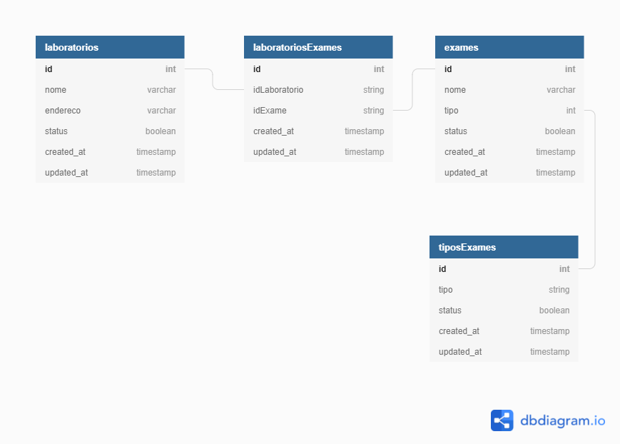

    
    
API Rest em NodeJs

 
 

    

        
<i>Desenvolvido por: <a href="mailto:caiov.messias@icloud.com">Caio Messias</a>
         
        Atualizado em: 20/12/2021
        </i>

    

----

[Sobre o projeto](#sobre-o-projeto) | [Tecnologias Utilizadas](#Tecnologias-utilizadas) | [Execução](#execução) | [Testes](#testes) | [Documentação](#documentação)

----  

## Sobre o Projeto  

O projeto consiste em ser uma API Rest desenvolvida em NodeJs que realiza o CRUD de Laboratórios e Exames.  
Além do CRUD é possível realizar a associação e desassociação de Exames e Laboratórios.  

 

    
    
<i>Relacionamentos do banco de dados</i>

## Tecnologias Utilizadas

Foram utilizadas as seguintes tecnologias na API.  
- NodeJs
- Express
- Sequelize
- Mysql
- Docker
- Jest

## Execução

Para executar o projeto em sua máquina é necessário possuir o Docker e o Docker compose instalados e configurados.

Collection disponibilizada no diretório `src/docs/collection`.

### Primeira execução do projeto

1. Clone o projeto  
`git clone https://github.com/caiovmessias/node_api.git`

2. Suba o container do Mysql  
`docker-compose up -d mysql-5.7`

3. Rode o comando abaixo para realizar a configuração do projeto  
`make setup`

4. Agora basta subir o container da API  
`make up`

Comandos uteis após a configuração do projeto:

- Iniciar o container da API e do Mysql  
`make up`

- Parar os containers da API e do Mysql  
`make down`

Para visualizar outros comandos, acesse o arquivo `Makefile`  

## Testes

Foi criado uma suíte de testes no projeto utilizando o Jest.

Os testes utilizam o banco de dados sqlite.

Para executar os testes rode o comando `yarn test`.

Caso os testes falhem, deve ser removido manualmente o arquivo do sqlite `__tests__/database.sqlite`.

## Documentação

Foi disponibilizado uma documentação dos endpoints da API via Swagger.  
Para visualiza-la basta rodar o projeto e acessar a rota `/docs`

### Documentação auxiliar para funcionamento das rotas de Lote

Para funcionamento correto da rota `/lote/exame` deve ser utilizado o parametro do tipo `Multipart Form` com o nome do parametro sendo `file` e enviar um arquivo `.csv` separado por virgula.

**Formato de entrada do arquivo**  

- **POST:** "nome,tipo"  
- **PUT:** "id,nome,tipo"  
- **DELETE:** "id"  
